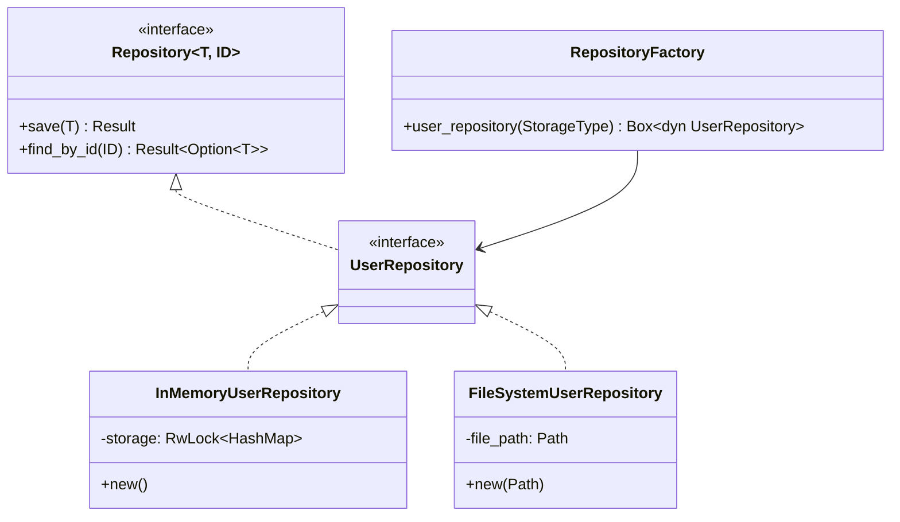

```mermaid
classDiagram
    class Repository~T, ID~ {
        <<interface>>
        +save(T) Result
        +find_by_id(ID) Result~Option~T~~
    }
    
    class UserRepository {
        <<interface>>
    }
    
    class InMemoryUserRepository {
        -storage: RwLock~HashMap~
        +new()
    }
    
    class FileSystemUserRepository {
        -file_path: Path
        +new(Path)
    }
    
    class RepositoryFactory {
        +user_repository(StorageType) Box~dyn UserRepository~
    }
    
    Repository <|.. UserRepository
    UserRepository <|.. InMemoryUserRepository
    UserRepository <|.. FileSystemUserRepository
    RepositoryFactory --> UserRepository
```
